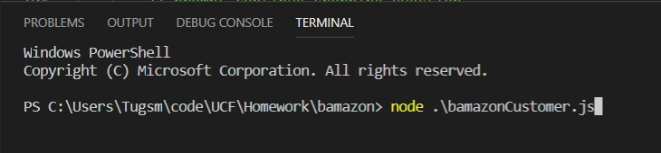
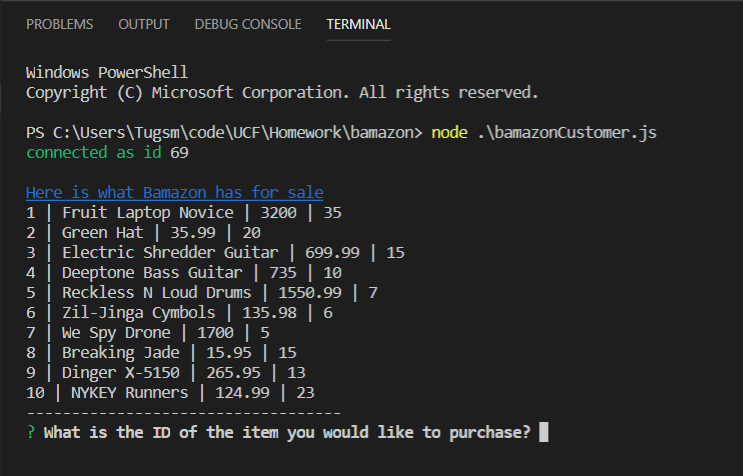
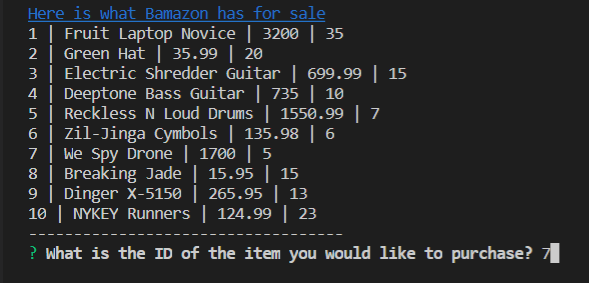
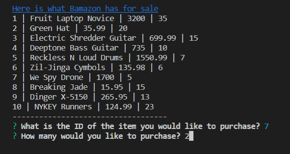
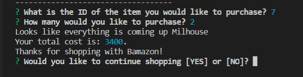
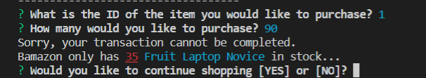
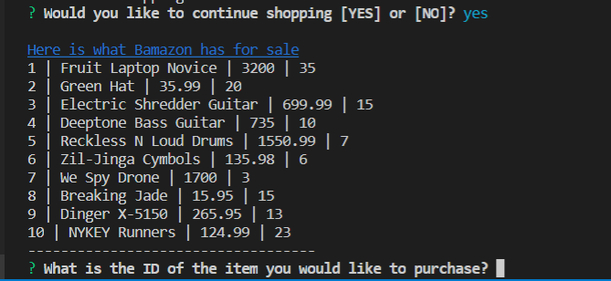
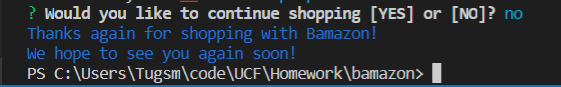

# Bamazon

## Overview
Bamazon is a CLI application that allows the user to purchase various items from Bamazon.

The terminal commands are listed below along with screen shots of how the commands are entered and what various results will be displayed for the user.

## Sections
- [Before You Start](#before-you-start)
- [How to Utilize Bamazon](#how-to-utilize-bamazon)
- [Purchasing a Product](#purchasing-a-product)
- [Purchase Complete](#purchase-complete)
- [Out of Stock](#out-of-stock)
- [Continue Shopping](#continue-shopping-or-leave-bamazon)

## Before You Start
### NPM Packages
Before you start using Bamazon, make sure you install all the NPM packages or you will not be able to use this application effectively.

### Please install...

##### Mysql
In the command line type:

    npm i mysql

#### Inquirer
In the command line type:

    npm i inquirer

#### Colors
In the command line type:

    npm i colors

## How to Utilize Bamazon
### Opening The Store
The first step in using Bamazon is to run the the `bamazonCustomer.js` file in your terminal. This can be seen in the picture below.

Once the file is run, Bamazon will display the items availible to purchase in the terminal, as shown below.

    NOTE: The Store display is a table divided into separate columns. The first column is the ID of the product. The Second is the name of the product. The third is the cost of the product.

    The fourth column is the number of items availible for that particular product. Normally this would not be displayed; however, for the purposes of this markdown, we are displaying it for you.

### Purchasing a Product
After Bamazon displays the availible products, it will prompt you with a question of which product you would like to purchase.

Simply enter in the `ID Number` of the product you would like to purchase, as shown below.

Once, a vailid Product ID is entered, Bamazon will prompt you with another question concerning the total number of the selected product you wish to purchase.

Simply enter in the total amount of products you wish to purchase, as shown below.

### Purchase Complete
If Bamazon has enough inventory to complete the purchase, the order will be completed.

Bamazon will display a confirmation message with the total cost of the purchase, as shown below.

### Out of Stock
If Bamazon does not have enough of the product in stock, the order will not go through and a message will be prompted explaining why, as shown below.

### Continue Shopping or Leave Bamazon
Once an order has been completed or declined, Bamazon will prompt you with a question to continue shopping or to leave the store.

If you enter `YES`, Bamazon will display a newly updated inventory table for you to choose from, as shown below.

    NOTE: The number of items availible for ID 7 has decreased by 2, since the order of 2 went through.

If you enter `NO`, then Bamazon will part with a goodbye message and the connection to the Bamazon store will end, as shown below.

